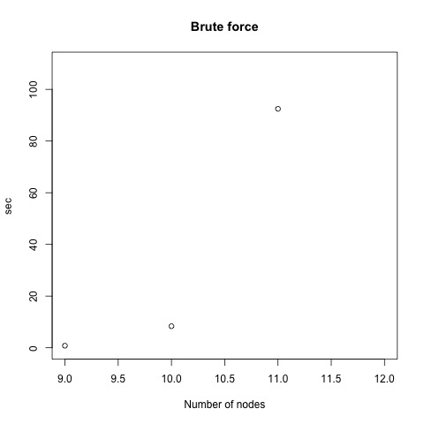
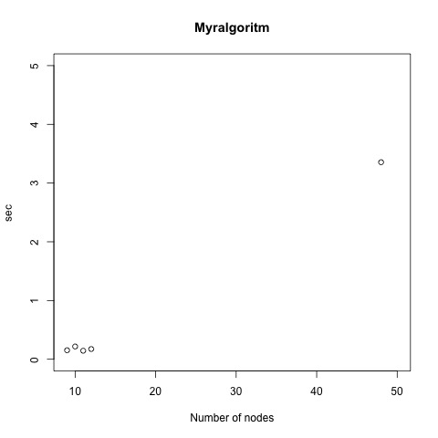

```{r setup, include=FALSE}
knitr::opts_chunk$set(echo = TRUE)
```

## Introduktion

* Jag har valt att lösa handelsresandeproblemet med en myr-algoritm
* Myr-algoritmen jämförs med en naiv algoritm som provar alla möjliga lösningar


## Handelsresandeproblemet

* Handelsresandeproblemet (Travelling Salesman Problem=TSP) går ut på att besöka alla städer i en karta och minimera avståndet
* Kartan brukar representeras med en graf där noderna är städer och vägarna är bågar
* Då alla noder är kopplade med bågar benämns grafen som komplett
* TSP med en komplett graf har många lösningar och tillhör en klass problem som (tros) sakna lösningar med polynomisk komplexitet (NP)
* Komplexiteten för en algoritm som provar alla möjliga lösningar är O(n!)


## Brute force algoritm

Noder: 

    [a,b,c,d]
    
Möjliga rutter och noder att besöka med start i nod a:
    
    (a,b) [b,c,d]
    (a,c) [c,b,d]
    (a,d) [d,b,c]

Använd algoritmen rekursivt på listan med återstående noder att besöka


## Brute force algoritm i Python

```{python eval = FALSE, echo=TRUE}
def all_routes(nodes):
    if len(nodes) <= 1:
        return [[]]

    res = []
    head = nodes.pop(0)
    for i in range(0, len(nodes)):
        nodes_cp = nodes[:]
        next_node = nodes_cp.pop(i)
        res += [[(head, next_node)] + 
               x for x in all_routes([next_node]+nodes_cp)]

    return res
```


## n! (fakultet) växer oerhört snabbt

```
----------------------------------------------------
  1:10    11:20   21:30     31:40    41:50    51:60   
------- -------- -------- -------- -------- --------
   1    3.99e+07 5.11e+19 8.22e+33 3.35e+49 1.55e+66
   2    4.79e+08 1.12e+21 2.63e+35 1.41e+51 8.07e+67
   6    6.23e+09 2.59e+22 8.68e+36 6.04e+52 4.27e+69
  24    8.72e+10 6.20e+23 2.95e+38 2.66e+54 2.31e+71
  120   1.31e+12 1.55e+25 1.03e+40 1.20e+56 1.27e+73
  720   2.09e+13 4.03e+26 3.72e+41 5.50e+57 7.11e+74
 5040   3.56e+14 1.09e+28 1.38e+43 2.59e+59 4.05e+76
 40320  6.40e+15 3.05e+29 5.23e+44 1.24e+61 2.35e+78
362880  1.22e+17 8.84e+30 2.04e+46 6.08e+62 1.39e+80
3628800 2.43e+18 2.65e+32 8.16e+47 3.04e+64 8.32e+81
----------------------------------------------------
```

Det finns $\sim10^{80}$ atomer i universum


<!--
```{r echo = FALSE}
n1 <- factorial(1:10)
n2 <- format(factorial(11:20), digits=3)
n3 <- format(factorial(21:30), digits=3)
n4 <- format(factorial(31:40), digits=3)
n5 <- format(factorial(41:50), digits=3)
n6 <- format(factorial(51:60), digits=3)
m <- data.frame(n1, n2, n3, n4, n5, n6)
library(pander)
t <- pandoc.table(m)
```
-->


## En första naiv myr-algoritm

* Sätt kostnader på bågarna
* Då en myra använder en båge läggs en mängd feromon som är omvänt proportionellt till kostnaden
* Låt myrorna vandra från start noden och fortsätta vandra tills de nått slutnoden eller max antal steg nåtts
* Myrorna väljer slumpvis båge och bågar med mycket feromon har större sannolihet att väljas än de med lite feromon


## Implementering i Python


```{python eval = FALSE, echo=TRUE}
def run():
  for genno in range(0, NO_OF_GENERATIONS):
    init_leg()
    init_ant()
    moveno = 0
    while moveno < NO_MOVES_PER_ANT and not stagnation():
      for antno in range(0, NO_OF_ANTS):
        move(antno)
      evaporate_pheromone()
      moveno += 1
```


## Implementering i Python (forts.)

```{python eval = FALSE, echo=TRUE}
  if ant[antno][0] is None:
    return

  (current_node, visited_nodes) = ant[antno]

  probs = calc_transition_probabilities(antno)
  selected_legno = select_random_leg(probs)
  selected_node = list(filter(lambda x: x[0] == 
                       selected_legno, node[current_node]))[0][1]
  deposit_pheromone(selected_legno)

  visited_nodes += [selected_node]
  if selected_node == STOP_NODE:
    ant[antno] = (None, visited_nodes)
  else:
    ant[antno] = (selected_node, visited_nodes)
```


## Dorigos algoritm

* Dorigo (1992) var den första som i detalj beskrev hur en myr-algoritm kan användas för att lösa TSP
* Myrorna väljer slumpvis bågar som ej besökts med hänsyn till feromon och synlighet, vilket här är 1/avstånd
    * Bågar med mycket feromon som är korta har större sannolikhet att väljas än övriga
* När myrorna besökt alla noder lägger de ut feromon omvänt proportionellt till avståndet för rutten
    * Myror vars rutt är kortare än övrigas lägger alltså ut mer feromon
* Algoritmen upprepas till dess att alla myror går samma väg eller max antal cykler uppnåtts


## Dorigos algoritm (forts.)

* Avståndet $d_{ij}$ mellan två koordinater $(x_i,y_i)$ och $(x_j, y_j)$ ges av  

$$
\begin{align}
	d_{ij} = ((x_i-x_j)^2 + (y_i-y_j)^2)^{0.5}
\end{align}
$$

## Dorigos algoritm (forts.)

Mängden feromon på en båge mellan noderna $i$ och $j$ ges av $\tau_{ij}$. $t$ representerar en iteration vilket innebär att alla myror förflyttat sig en nod. Om grafen har $n$ noder ges $\tau_{ij}$ vid tidpunkten $t$ av:

$$
\begin{align}
	\tau_{ij}(t+n)=\rho \cdot \tau_{ij}(t) + \Delta\tau_{ij}
\end{align}
$$

$$
\begin{align}
	\Delta\tau_{ij} &= \sum_{k=1}^{m} \Delta\tau_{ij}^k & \text{där } m \text{ är antalet myror}
\end{align}
$$


$\rho$ definieras så att $1-\rho$ representerar avdunstningen under en cykel. 


## Dorigos algoritm (forts.)

$\Delta\tau_{ij}^k$ ges av:

$$
\begin{align}
	\Delta\tau_{ij}^k = \begin{cases}
		\frac{Q}{L_k} & \text{om myra } k \text{ använder bågen } (i,j), \\
		0 & \text{annars}	
	\end{cases}
\end{align}
$$

$Q$ är en godtycklig konstant och $L_k$ är längden på den sträcka som myra $k$ färdats.

## Dorigos algoritm (forts.)

$N$ är mängden av alla noder och $tabu_k$ är de noder som myra $k$ har besökt. Vid varje tidpunkt ges sannolikheten att myra $k$ går från nod $i$ till nod $j$ av $p_{ij}^{k}$.


$$
\begin{align}
	p_{ij}^{k} = \begin{cases}
		\frac
			{\tau_{ij}^{\alpha} \cdot (1/d_{ij})^{\beta}}
			{\sum_{k\in allowed_k} \tau_{ik}^{\alpha} \cdot (1/d_{ik})^{\beta}}  & \text{om } k \in allowed_k,\\
		0 & \text{annars}
	\end{cases}
\end{align}
$$

där $allowed_{k} = {N - tabu_{k}}$ och $d_{ik}$ är avståndet, eller kostnaden, mellan nod $i$ och $j$. $\alpha$ och $\beta$ kontrollerar hur viktigt feromonen är i förhållande till avstånden mellan noderna.

## Dorigos algoritm (forts.)

* Maximalt antal cykler sätts som en parameter (här satt till 100)
* Algoritmen avslutas då alla myror tar samma väg, kallas stagnation
* I samtliga körningar stagnerade algoritmen innan maximalt antal cykler uppnåtts


## Implementering i Python

```{python eval = FALSE, echo=TRUE}
cycleno, best_ant = 0,(None, float('inf'), [])
while not stagnation() and cycleno < NCMAX:
    empty_dist_and_visited()
    for antno in range(0, NO_OF_ANTS):
        for moveno in range(0, len(map_funcs.EDGES)):
            if not all_nodes_visited(antno):
                move(antno)
        deposition_pheromone_it(antno)
    evaporate_pheromone()
    sort_ants()
    if ANT[0][1] < best_ant[1]:
        best_ant = ANT[0]
    print("Cycle: {:d}".format(cycleno), ANT[0], ANT[len(ANT)-1])
    cycleno += 1
print('Best ant:', best_ant)
print('Total number of nodes: {:d}'.format(len(best_ant[2])+1))
```

## Implementering i Python (forts.)

```{python eval = FALSE, echo=TRUE}
def move(antno):
    (current_node, accumulated_dist, visited_nodes) = ANT[antno]

    (node1, node2, dist) = select_random_edge(
                             calc_transition_probabilities(antno))
    assert current_node == node1 or current_node == node2

    visited_nodes += current_node
    accumulated_dist += dist

    if current_node != node1:
        current_node = node1
    else:
        current_node = node2

    ANT[antno] = (current_node, accumulated_dist, visited_nodes)
```

## Kartor beskrivs med en text-fil

Exempel på karta med 9 städer/noder

```{r engine='bash', comment='', echo=FALSE}
cat ../ant-cycle/MAP0.txt
```

## Exekvering med 9 noder

```
(venv3) 18:13:19-jonas~/git/colmsjo/kogvet/tig105/projekt/ant-cycle (master)$ python ants.py MAP0.txt 
Cycle: 0 ('i', 67.35153247214107, ['a', 'b', 'e', 'd', 'g', 'f', 'h', 'c']) ('i', 96.068235280669, ['a', 'f', 'h', 'c', 'g', 'd', 'b', 'e'])
Cycle: 1 ('i', 65.95212654266408, ['a', 'd', 'b', 'e', 'g', 'f', 'h', 'c']) ('e', 95.65414505790523, ['a', 'd', 'g', 'f', 'h', 'c', 'i', 'b'])
Cycle: 2 ('i', 68.69550064060493, ['a', 'g', 'd', 'b', 'e', 'f', 'c', 'h']) ('e', 93.16721604508798, ['a', 'd', 'g', 'f', 'c', 'h', 'i', 'b'])
Cycle: 3 ('i', 63.465197529846826, ['a', 'd', 'b', 'e', 'g', 'f', 'c', 'h']) ('e', 84.06897688401341, ['a', 'f', 'h', 'c', 'i', 'g', 'd', 'b'])
Cycle: 4 ('i', 68.69550064060493, ['a', 'g', 'd', 'b', 'e', 'f', 'c', 'h']) ('i', 86.85363109707171, ['a', 'g', 'd', 'b', 'e', 'h', 'c', 'f'])
Cycle: 5 ('i', 68.69550064060493, ['a', 'g', 'd', 'b', 'e', 'f', 'c', 'h']) ('i', 71.18242965342218, ['a', 'g', 'd', 'b', 'e', 'f', 'h', 'c'])
Cycle: 6 ('i', 68.69550064060493, ['a', 'g', 'd', 'b', 'e', 'f', 'c', 'h']) ('d', 94.79047168487612, ['a', 'g', 'f', 'c', 'h', 'i', 'b', 'e'])
Cycle: 7 ('i', 68.69550064060493, ['a', 'g', 'd', 'b', 'e', 'f', 'c', 'h']) ('i', 71.62685579250856, ['a', 'g', 'd', 'e', 'b', 'f', 'h', 'c'])
Cycle: 8 ('i', 68.69550064060493, ['a', 'g', 'd', 'b', 'e', 'f', 'c', 'h']) ('i', 69.13992677969132, ['a', 'g', 'd', 'e', 'b', 'f', 'c', 'h'])
Cycle: 9 ('i', 68.69550064060493, ['a', 'g', 'd', 'b', 'e', 'f', 'c', 'h']) ('i', 69.13992677969132, ['a', 'g', 'd', 'e', 'b', 'f', 'c', 'h'])
Cycle: 10 ('i', 68.69550064060493, ['a', 'g', 'd', 'b', 'e', 'f', 'c', 'h']) ('i', 68.69550064060493, ['a', 'g', 'd', 'b', 'e', 'f', 'c', 'h'])
Best ant: ('i', 63.465197529846826, ['a', 'd', 'b', 'e', 'g', 'f', 'c', 'h'])
Total number of nodes: 9
```


## Resultat

Myr-algoritmen är stokastisk och garanterar inte samma resultat vid flera exekveringar

| Noder  | Brute force | Myr-algoritm | Kommentar|
|:------:|:-----------:|:------------:|:---------|
| 9      | 63.47       |  63.47       |          |
| 10     | 64.88       |  64.88       |          |
| 11     | 71.22       |  71.79       |          |
| 12     | avslutades ej |  72.68       | BF:s minnesanvändning > 10GB |
| 48     |             |  237.68      |          |


## Resultat (forts.)

Myr-algoritmens komplexitet är $O(NC \cdot n^2 \cdot m)$ där $NC$ är maximala antalet cykler som tillåts.

| Noder  | Brute force | Myr-algoritm | Kommentar|
|:------:|:-----------:|:------------:|:---------|
| 9      | 0m0.803s    |  0m0.153s    |          |
| 10     | 0m8.352s    |  0m0.217s    |          |
| 11     | 1m32.474s   |  0m0.145s    |          |
| 12     | avslutades ej |  0m0.174s    | BF:s minnesanvändning > 10GB |
| 48     |             |  0m3.355s    |          |


## Diskussion

* För handelsresandeproblem med mer än c:a 10 noder är myr-algoritmen ett bra alternativ eftersom brute force algoritmer inte är praktiska
* Det finns andra stokastiska metoder som t.ex. simulated annealing men tiden har inte tillåtet att inkludera den i jämförelsen
* Dorigos myr-algoritm förutsätter att grafen är komplett, dvs. att alla noder går att nå från varje annan nod
    * En intressant vidareutveckling hade varit att tillåta mer realistiska grafer som inte är kompletta


## Referenser

* M. Dorigo, V. Maniezzo, and A. Colorni. 1996. The ant system: Optimization by a colony of cooperating agents. IEEE Transactions on Systems, Man and Cybertnetics-PartB, 1:1–13.
* M. Dorigo. 1992. Optimization, Learning and Natural Algorithms. Ph.D. thesis, Dip. Elettronica e Informazione, Politenico di Milano, Italy.
* Wikipedia. 2017. Ant colony optimization. https://en.wikipedia.org/wiki/Ant_colony_ optimization_algorithms.


## Exekveringstider



## Exekveringstider



## Notes


The following single character keyboard shortcuts enable alternate display modes:

* 'f' enable fullscreen mode
* 'w' toggle widescreen mode
* 'o' enable overview mode
* 'h' enable code highlight mode
* 'p' show presenter notes


